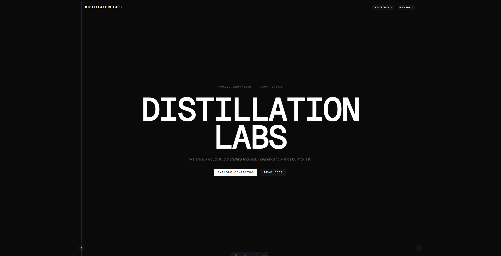

# Distillation Labs Website



Multilingual marketing site for Distillation Labs built with Astro and Tailwind CSS. The project includes the localized home page and the Contextro pages, with language-prefixed routes and a safe redirect from the root path to /en/.

## Stack

- Astro 6
- Tailwind CSS 4
- Bun
- Netlify static deployment

## What's included

- Localized home page in six languages: en, es, fr, de, nl, and pl
- Product page for Contextro
- Documentation page for Contextro
- Language switcher in the navigation
- Root redirect from / to /en/

## Main routes

- / redirects to /en/
- /en/
- /es/
- /fr/
- /de/
- /nl/
- /pl/
- /[locale]/contextro
- /[locale]/contextro/docs

## Local development

### Requirements

- Bun

### Commands

```bash
bun install
bun dev
bun run build
bun run preview
```

## Structure

```text
.
├── public/
│   ├── images/
│   └── scripts/
├── src/
│   ├── components/
│   ├── layouts/
│   ├── lib/
│   ├── pages/
│   └── styles/
├── astro.config.mjs
├── middleware.ts
└── package.json
```

## Routing notes

- The default locale is en.
- All public pages use a language prefix.
- The root route always redirects to /en/ to avoid locale-less paths.
